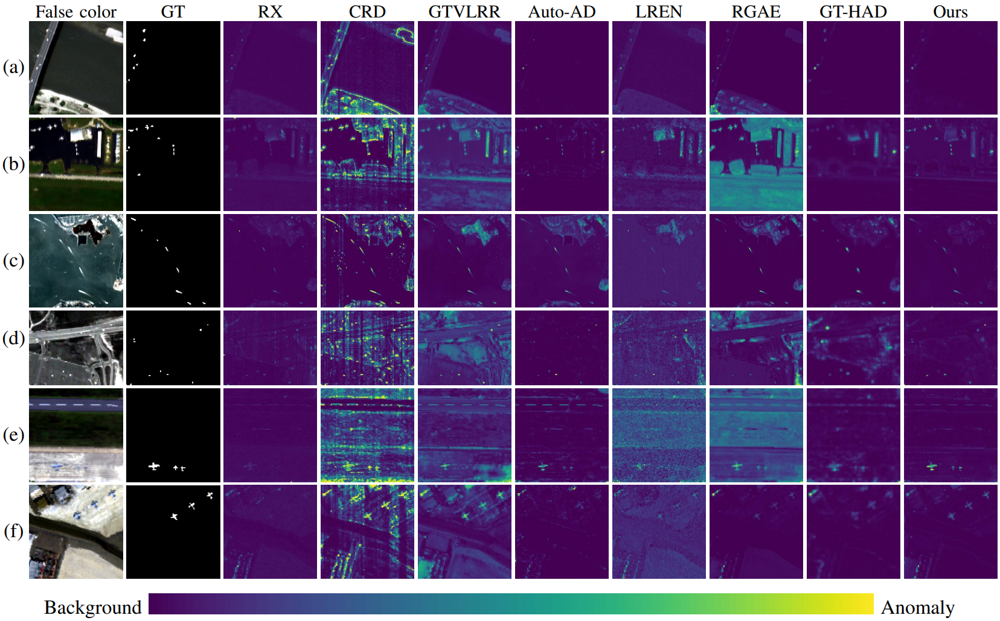

# FMCNet: A Fast Mamba–Convolution Hybrid Network for Hyperspectral Anomaly Detection

------

## Code Availability

The implementation of FMCNet will be made publicly available upon acceptance of the paper.

------

## Abstract

Hyperspectral anomaly detection (HAD) aims to identify anomalous targets that deviate from background regions in hyperspectral images and has attracted increasing attention in remote sensing data processing. Existing deep learning methods typically rely on deep network stacking or self-attention, which improve detection accuracy but also incur prohibitive computational costs. To overcome this limitation, we propose FMCNet, a fast Mamba-Convolution hybrid network for hyperspectral anomaly detection, which is specifically designed to integrate computationally efficient spectral-spatial modeling and background reconstruction. Specifically, a state-space model branch explicitly incorporates Fourier frequency bias into the Mamba modeling process to capture long-range spectral dependencies with linear computational complexity. Concurrently, a spatial branch utilizes depthwise separable convolutions and adaptive positional encoding to efficiently perceive global spatial structures. Furthermore, to prevent improper spatial-spectral fusion from degrading background reconstruction, an adaptive spatial-spectral fusion gating (SSFG) module is proposed to dynamically allocate competitive weights to spectral and spatial features, thereby enabling stable feature fusion and suppressing background redundancy. Extensive experiments on six public hyperspectral datasets demonstrate that FMCNet achieves state-of-the-art detection accuracy while significantly reducing inference time, showing strong potential for practical fast HAD applications.

------

## Detection Results

<i>Detection results of different methods on the six real datasets</i>

